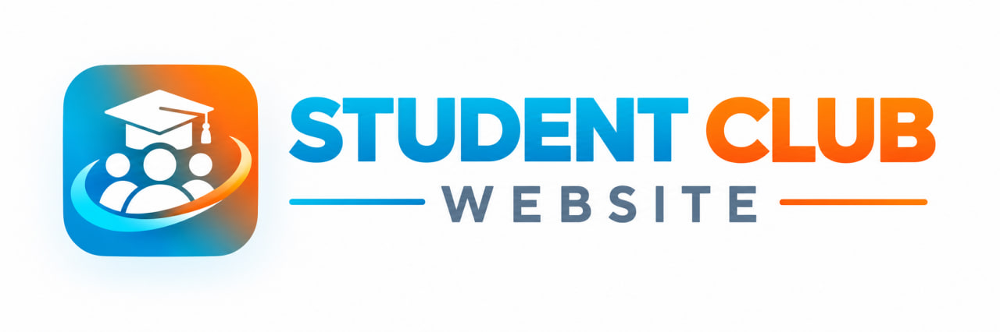

# PNC Student Club Website

A responsive multi-page student club portal for Passerelles Numériques Cambodia (PNC). The website helps students explore clubs, read success stories, join communities, and contact the club secretariat.

## Team



## Project Overview

This project is a modern student club website built to:

- showcase campus clubs and categories
- help students discover activities based on their interests
- share student stories and club impact
- allow potential members to submit a club application
- provide a contact page for inquiries and communication

## Pages Included

The website includes the following main pages:

- Home page
- Clubs page with search and category filtering
- Stories page highlighting student experiences
- Join a Club page with registration form
- Contact page with contact details and inquiry form

## Features

- Responsive layout for desktop and mobile devices
- Sticky navigation bar with mobile menu
- Club categories section and club cards
- Search and filter experience on the clubs page
- Student stories and impact highlights
- Join form for club applications
- Contact form and campus communication information
- Clean UI using modern color styling and icons

## Tech Stack

- HTML
- CSS
- JavaScript / TypeScript
- Vite
- Tailwind CSS

## Project Structure

```bash
student-club-website-group7/
├── index.html
├── package.json
├── package-lock.json
├── tsconfig.json
├── vite.config.ts
├── page/
│   ├── club.html
│   ├── contact.html
│   ├── join.html
│   └── stories.html
├── public/
│   ├── image/
│   └── image.png
├── src/
│   ├── main.ts
│   ├── counter.ts
│   └── style.css
└── README.md
```

## Run the Project Locally

1. Install dependencies:

```bash
npm install
```

2. Start the development server:

```bash
npm run dev
```

3. Open the local Vite URL shown in the terminal, usually:

```bash
http://localhost:5173
```

## Build for Production

```bash
npm run build
```

## Notes

This project was designed as a student club portal for a campus community and is intended to be easy to extend with more club data, forms, or animations in the future.

## Team / Contribution

This website was created as a group project to showcase student engagement, club life, and leadership opportunities at PNC.

---

If you want, I can also turn this into a more polished GitHub-style README with badges, screenshots, and a stronger project summary.
